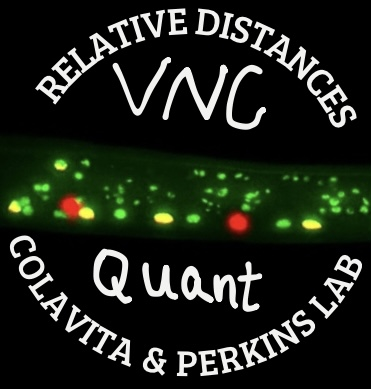
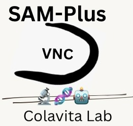

[](https://hub.docker.com/r/ssaha078/sam_plus_vnc)
[](https://hub.docker.com/r/ssaha078/vnc_quant_gui)
[](https://www.biorxiv.org/content/10.1101/2024.11.16.623955v2.abstract)
[](https://www.uottawa.ca/faculty-medicine/)


# VNC-Dist  
<table>
  <tr>
    <td align="right">
      
    </td>
    <td align="left">
      
    </td>
  </tr>
</table>


### Robust and unbiased pipeline for Ventral Nerve Cord neuronal positioning analysis in *C.elegans*

* This repository features a Python backend and a Streamlit Docker app that implement SAM-Plus for worm segmentation and VNC-Quant for measuring distances. It calculates the normalized relative distances of SAB, DA, DD, and DB neurons along the AP axis of VNC, using SABVL (0%) and the rectum (100%) as reference points.

* VNC-Dist pipeline(Ventral Nerve Cord Distances)(v1.0), an open-source user-friendly GUI-based software toolbox designed to overcome the limitations of subjective motoneuron positioning analysis in microscopy.

* VNC-Dist was written by Saber Saharkhiz from Drs. Antonio Colavita & Theodore J. Perkins' Lab. To learn more about it, read the [paper](https://www.biorxiv.org/content/10.1101/2024.11.16.623955v2.abstract).
* For insights into the significance of this pipeline for studying neuronal positioning in the VNC of *C. elegans*, please refer to the following [paper](https://www.cell.com/developmental-cell/fulltext/S1534-5807(17)30210-1) from our lab:

Shah, Pavak K., et al. "PCP and SAX-3/Robo pathways cooperate to regulate convergent extension-based nerve cord assembly in C. elegans." Developmental cell 41.2 (2017): 195-203.


# Overview

The following figure outlines the design of the VNC-Dist pipeline. First, CZI images are compressed and merged, and neuron coordinates are extracted using Fiji/ImageJ. These data are then processed in two steps: (a) SAM-Plus and (b) VNC-Quant.

<p align="center">
  
</p>


# CITATION
If you use VNC-Dist, please cite the [paper](https://www.biorxiv.org/content/10.1101/2024.11.16.623955v2.abstract):


Saharkhiz, Saber, et al. "VNC-Dist: A machine learning-based pipeline for quantification of neuronal positioning in the ventral nerve cord of C. elegans." bioRxiv (2024): 2024-11.


# Installation and Usage

This pipeline supports Python 3.9–3.12 and can be easily installed to run SAM-Plus and VNC-Quant.


  
- <div style="display: flex; justify-content: space-between; align-items: center;">
  <strong style="font-size: 2.2em;">Docker-based Execution (Recommended):</strong>
  
</div>


  
Execute the pipeline using Docker images by installing [Docker](https://www.docker.com/products/docker-desktop/) on your system (available for Windows, Mac, or Linux).


1) Download this web-based GUI from Docker Hub: (fully functional offline)
```bash
docker pull ssaha078/vnc_quant_gui:latest
```
2) Launch the GUI from your command prompt:
```bash
docker run -d -p 8501:8501 ssaha078/vnc_quant_gui:latest
```
3)  Open your web browser and navigate to:(port: 8501)
 ```bash
http://localhost:8501
```

--------------------------------------------------------------


1) Download this web-based GUI from Docker Hub: (fully functional offline)

```bash
docker pull ssaha078/sam_plus_vnc:latest
```
2) Launch the GUI from your command prompt:
 ```bash
docker run -d -p 8502:8501 ssaha078/sam_plus_vnc:latest
```
3)  Open your web browser and navigate to:(port: 8502)
 ```bash
http://localhost:8502
```
------------------------------------------------------------

### Verifying it works: 
 ```bash
docker ps 
```

Your containers appear in the list as ssaha078/vnc_quant_gui:latest (VNC-Quant) and ssaha078/sam_plus_vnc:latest (SAM-Plus), each with its container ID.

### To stop the running container:
 ```bash
docker stop [CONTAINER ID]
```

- Launcher files (.bat for Windows and .sh for Linux) are available for quick desktop access. You can find them in [VNC-Dist/SAM-Plus](./VNC-Dist/SAM-Plus) and [VNC-Dist/VNC-Quant](./VNC-Dist/VNC-Quant).

--------------------------------------------------------------

### Notes
SAM-Plus mandates a dedicated GPU (e.g., NVIDIA GeForce RTX).


<div align="center">
  <table style="border-collapse: collapse; border: 0;">
    <tr>
      <td align="right" style="border: 0; padding: 0;">
        
      </td>
      <td align="left" style="border: 0; padding: 0;">
        
      </td>
    </tr>
  </table>
</div>


